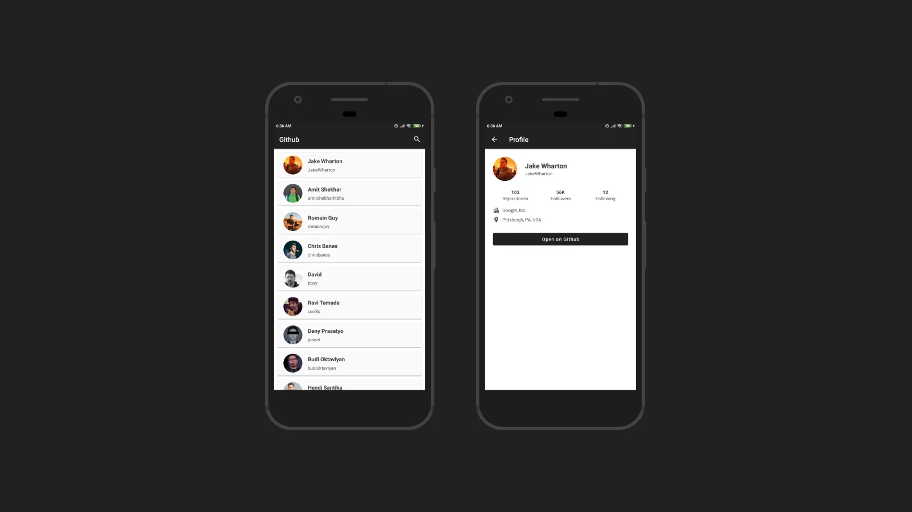
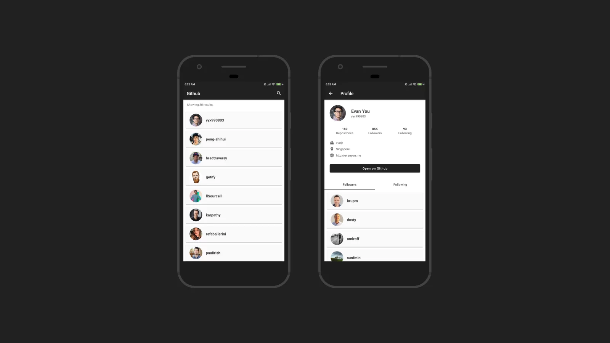
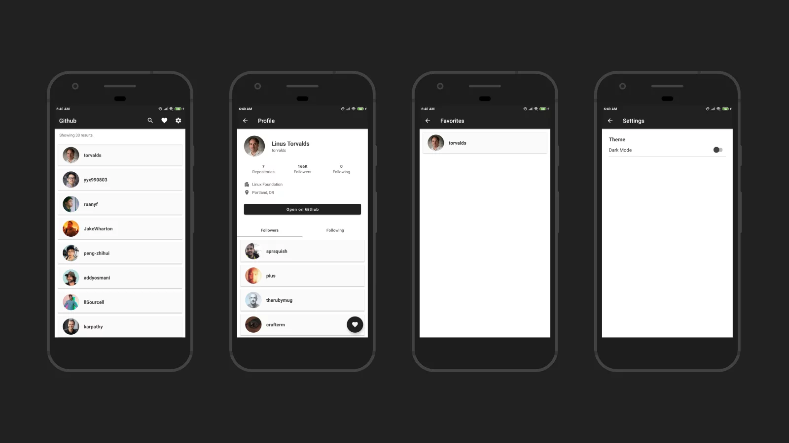

# SIB 2022: Android Fundamental Submission
Repositori ini mengandung source code proyek submission dari kelas "Belajar Fundamental Aplikasi Android".

## Disclaimer ⚠️
Repositori ini dibuat untuk tujuan edukasi. Plagiarisme untuk pengerjaan proyek submission tidak dapat diterima dan itu bukan tanggung jawab Saya sebagai pemilik repositori ini. Mohon kerjakan proyek submission Anda dengan jujur!

## Submission 1: GitHub User App

Review Rating : ⭐⭐⭐⭐⭐

Submission Checklists :
* [x] Menampilkan data pada halaman aplikasi dengan minimal jumlah 10 item.
* [x] Menggunakan RecyclerView.
* [x] Menampilkan avatar dan informasi user pada halaman Detail User.
* [x] Menggunakan Parcelable sebagai interface dari obyek data yang akan dikirimkan antar Activity.
* [x] List Item untuk RecyclerView disusun menggunakan ConstraintLayout.
* [x] Aplikasi tidak force closed.

## Submission 2: Github User App (Navigation & API)

Review Rating : ⭐⭐⭐⭐⭐

Submission Checklists :
* [x] Mempertahankan fitur pada Submission 1. 
* [x] Pencarian User menggunakan data dari API berjalan dengan baik.
* [x] Menggunakan TabLayout sebagai navigasi antara halaman List Follower dan List Following.
* [x] Terdapat indikator loading saat aplikasi memuat data di semua halaman.
* [x] Aplikasi tidak force closed.

## Submission 3: Github User App

Review Rating : ⭐⭐⭐⭐⭐

Submission Checklists :
* [x] Aplikasi bisa menambah user ke daftar favorite.
* [x] Aplikasi bisa menghapus user dari daftar favorite.
* [x] Halaman yang menampilkan daftar user favorite.
* [x] Terdapat pengaturan untuk mengganti tema.
* [x] Mempertahankan semua fitur aplikasi dan komponen yang digunakan pada Submission 2.
* [x] Aplikasi tidak force closed.